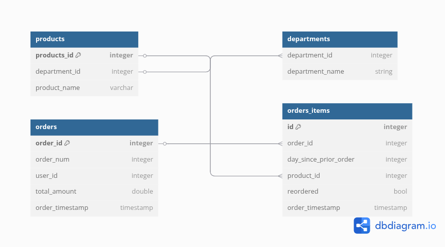

# Lakkhouse Architecture for E-commerce Transactions

## Project Overview
This project demonstrates how to design and implement a production-ready Lakehouse architecture for an e-commerce platform using AWS services. The pipeline:

- Ingests raw transactional data from Amazon S3
- Cleans and deduplicates data using Apache Spark + Delta Lake
- Exposes cleaned data for analytics via Amazon Athena
- Uses AWS Step Functions for orchestration
- Implements CI/CD automation with GitHub Actions


### System Architecture
.png)


## ER Diagram For Delta Table



## Getting Started
Clone the repository: 
```bash 
git clone https://github.com/GEssuman/Lakehouse-Architecture-for-Ecommerce-Transactions.git
cd Lakehouse-Architecture-for-Ecommerce-Transactions
```

To test the glue job locally ...
### Environment Setup
1. Create a .env file based on the example.env template:
```bash
cp example.env .env
```
2. Populate it with your AWS credentials and configuration values.
To get started with the project, create .env file and populate the caraible in the example.env file with nwith resqective values.


### Installing JAR Files for Excel Support
This project requires additional JARs to enable reading .xlsx Excel files in Spark.

1. Change directory to the Glue JAR directory:
```bash
cd glue-libs
```
2. Run the provided script to download the necessary JARs.

### Run the Glue Job Locally Using Docker
Start the Glue environment:
```bash
docker compose up -d
docker exec -it glue-local-ec bash
```
Inside the container, run the Glue job:
```bash
spark-submit   --conf spark.jars=$(echo /opt/glue/libs/*.jar | tr ' ' ',')   glue-scripts/ecommerce-transform-job.py   --JOB_NAME ecmon
```

## Upload JARs to S3
To use these JARs in your actual AWS Glue job (not local), upload them to an S3 bucket.
Then configure your Glue job to reference these JARs using the `--extra-jars` or `--additional-python-modules argument.`


## Step Function Graph
.png)